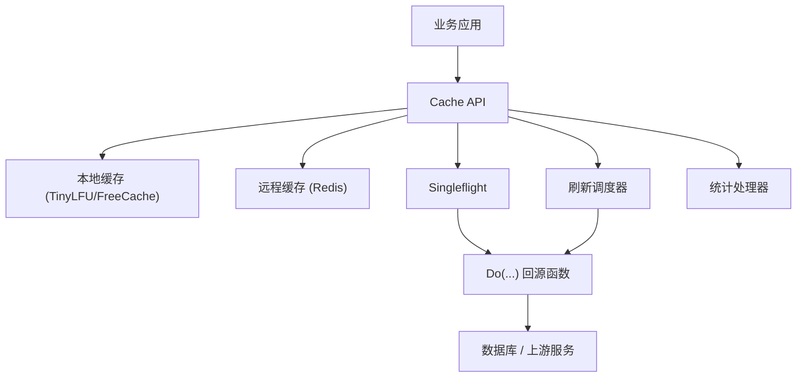
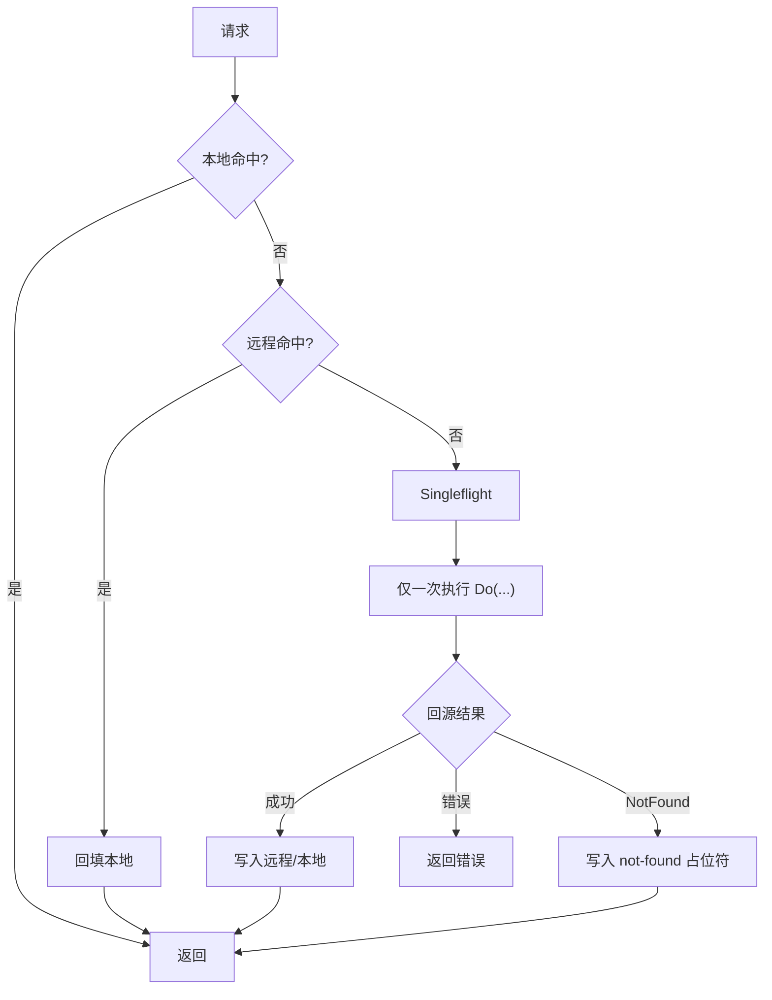
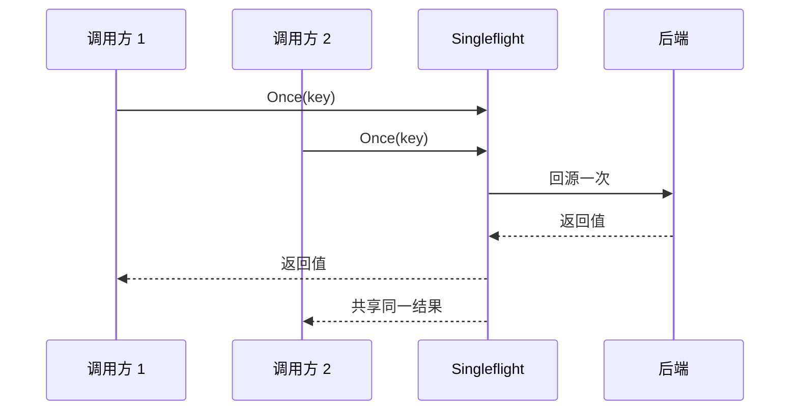
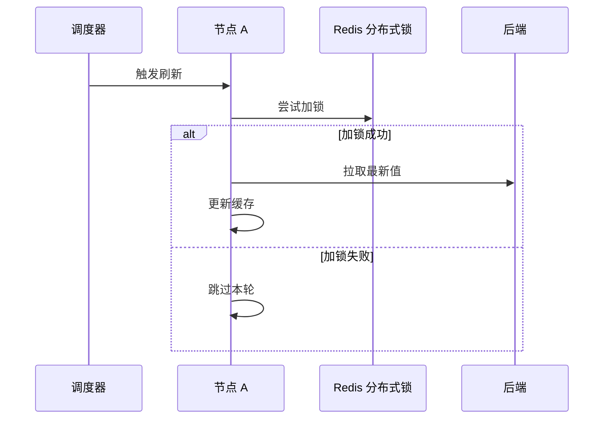

# 系统架构

`jetcache-go` 是一个分层缓存框架，面向 cache-aside 读路径与高并发保护。

## 分层视图

## 缓存模式

- `local`：仅进程内缓存，延迟最低，但不跨节点共享。
- `remote`：仅远程缓存，跨节点一致性更强。
- `both`：本地 + 远程，适合高 QPS 读接口。

## 读路径（`Once`）

关键点：读路径应优先使用 `Once(...) + Do(...)`，让并发 miss 合并为一次回源。

## Singleflight 行为

## 自动刷新行为

自动刷新是 key 级别显式开启（`cache.Refresh(true)`）。

仅建议对少量热点且回源代价高的 key 开启刷新。

## 组件职责

| 组件 | 职责 | 内置实现 |
| --- | --- | --- |
| `local.Local` | 进程内缓存 | `TinyLFU`、`FreeCache` |
| `remote.Remote` | 共享缓存后端 | `go-redis/v9` 适配器 |
| `encoding.Codec` | 序列化 | `msgpack`、`json`、`sonic` |
| `stats.Handler` | 指标统计 | logger、Prometheus 插件 |
| `singleflight` | miss 合并 | `x/sync/singleflight` |
| 刷新调度器 | 周期更新 | 内置实现 |

## 设计要点

- key 规则在读写两端必须一致。
- `WithErrNotFound(...)` 要与真实数据源 not-found 错误对齐。
- 开启刷新时建议配置 `WithStopRefreshAfterLastAccess(...)`。
- 服务优雅退出时调用 `Close()` 停止后台任务。
