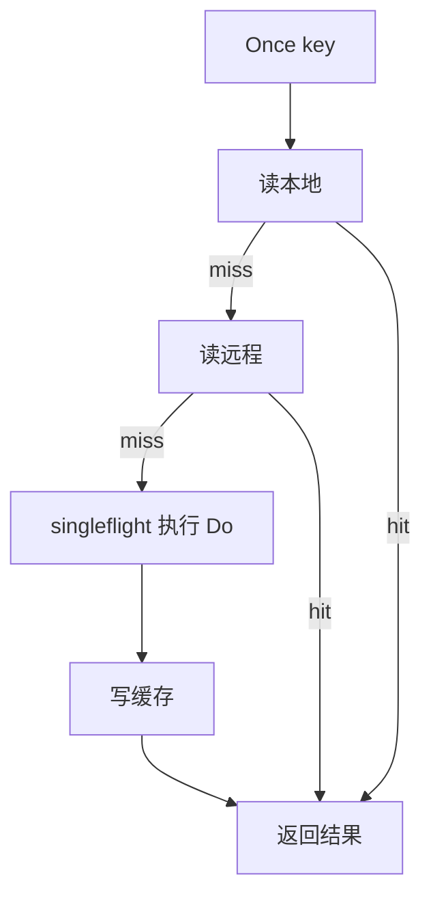

# Cache API 参考

本文档为 `jetcache-go` 的紧凑版 API 参考。

## Cache 接口

`cache.New(...)` 返回的 `Cache` 主要方法如下：

| 方法 | 作用 |
| --- | --- |
| `Set(ctx, key, opts...)` | 写缓存。 |
| `Once(ctx, key, opts...)` | Cache-aside 读取，含 singleflight。 |
| `Get(ctx, key, val)` | 读取并反序列化。 |
| `GetSkippingLocal(ctx, key, val)` | 仅走远程读取路径。 |
| `Delete(ctx, key)` | 删除本地 + 远程缓存。 |
| `DeleteFromLocalCache(key)` | 仅删本地缓存。 |
| `Exists(ctx, key)` | 按读取路径判断是否存在。 |
| `TaskSize()` | 当前进程刷新任务数量。 |
| `CacheType()` | `local`、`remote`、`both`。 |
| `Close()` | 停止刷新/事件协程并释放资源。每个缓存实例生命周期内应只调用一次。 |

## ItemOption

| 选项 | 类型 | 说明 |
| --- | --- | --- |
| `Value(v)` | `any` | `Set` 的输入值；`Once` 的输出目标。 |
| `Do(fn)` | `func(context.Context) (any, error)` | miss 时回源函数，优先级高于 `Value`。 |
| `TTL(d)` | `time.Duration` | 远程 TTL。`0` 用默认值，`<0` 不写远程。 |
| `SetNX(true)` | `bool` | 仅远程：key 不存在才写。 |
| `SetXX(true)` | `bool` | 仅远程：key 已存在才写。 |
| `SkipLocal(true)` | `bool` | 读取时跳过本地缓存。 |
| `Refresh(true)` | `bool` | 为该 key 启用刷新任务（需 `WithRefreshDuration`，且应配合 `Do(...)` 使用）。 |

## 核心示例

```go
package main

import (
	"context"
	"time"

	cache "github.com/mgtv-tech/jetcache-go"
	"github.com/mgtv-tech/jetcache-go/local"
	"github.com/mgtv-tech/jetcache-go/remote"
	"github.com/redis/go-redis/v9"
)

func main() {
	rdb := redis.NewClient(&redis.Options{Addr: "127.0.0.1:6379"})
	c := cache.New(
		cache.WithName("api-demo"),
		cache.WithLocal(local.NewTinyLFU(100_000, time.Minute)),
		cache.WithRemote(remote.NewGoRedisV9Adapter(rdb)),
	)
	defer c.Close()

	// Set
	_ = c.Set(context.Background(), "user:1001", cache.Value("alice"), cache.TTL(30*time.Minute))

	// Once
	var user string
	_ = c.Once(context.Background(), "user:1002",
		cache.Value(&user),
		cache.Do(func(context.Context) (any, error) {
			return "bob", nil
		}),
	)

	// Delete
	_ = c.Delete(context.Background(), "user:1001")
}
```

## `Once` 执行模型



## 泛型 API

通过 `NewT[K, V]` + `cache.Cache` 实例获取类型安全接口：

| 方法 | 作用 |
| --- | --- |
| `Set(ctx, key, id, v)` | 泛型写缓存。 |
| `Get(ctx, key, id, fn)` | 泛型 once 读取。 |
| `Delete(ctx, key, id)` | 泛型删除。 |
| `Exists(ctx, key, id)` | 泛型存在性检查。 |
| `MGet(ctx, key, ids, fn)` | 泛型批量读取（默认有损容错）。 |
| `MGetWithErr(ctx, key, ids, fn)` | 泛型批量读取（显式返回错误）。 |

`MGet` 回源函数（`fn`）与远程 pipeline 优化从 `v1.1.0+` 开始可用。

`MGet` 流程：


## `MGet` 语义

- `MGet(...)` 默认是“尽力返回可用结果”的模式。
- miss 的 ID 在提供 `fn` 时会回源并回写缓存。
- 对 `fn` 未返回的 ID，jetcache 会写入短 TTL 的 not-found 占位符，降低重复穿透。
- 若上游需要显式感知局部失败，请使用 `MGetWithErr(...)`。

## 错误语义

- `Once(...)` 对外通常不暴露原始 miss，而是执行 `Do(...)`。
- 若配置 `WithErrNotFound(err)` 且 `Do(...)` 返回该错误，会写入占位符并在后续读取返回同一错误。
- `MGet(...)` 默认优先返回可用结果，且可能缓存缺失 ID 的占位符；若上游需要完整错误信息，请使用 `MGetWithErr(...)`。
