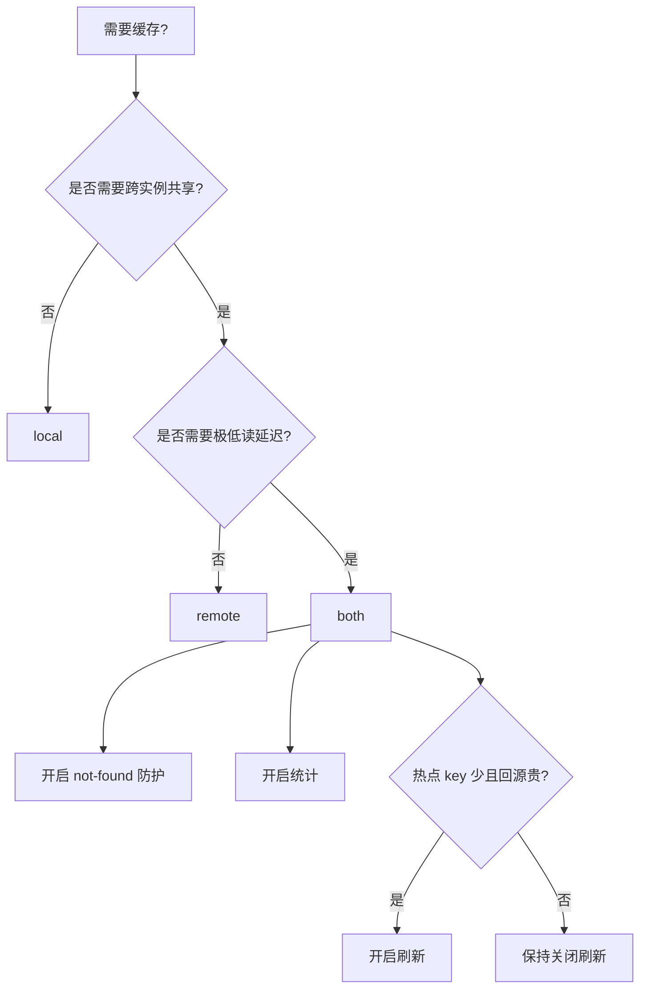

# 配置项参考

本文档定义 `cache.WithXxx(...)` 配置项与最小配置模式。

## 配置矩阵

| 配置项 | 类型 | 默认值 | 说明 |
| --- | --- | --- | --- |
| `WithName(name)` | `string` | `"default"` | 用于日志和指标标识。 |
| `WithRemote(remote)` | `remote.Remote` | `nil` | 远程缓存后端。 |
| `WithLocal(local)` | `local.Local` | `nil` | 本地缓存后端。 |
| `WithCodec(codec)` | `string` | `"msgpack"` | 必须已注册。未注册会在 `cache.New(...)` 时 panic。 |
| `WithErrNotFound(err)` | `error` | `nil` | 未找到哨兵错误，用于防穿透。 |
| `WithRemoteExpiry(d)` | `time.Duration` | `1h` | 远程默认 TTL。 |
| `WithNotFoundExpiry(d)` | `time.Duration` | `1m` | not-found 占位符 TTL。 |
| `WithOffset(d)` | `time.Duration` | `notFoundExpiry/10`（上限 `10s`） | not-found 占位符 TTL 抖动。 |
| `WithRefreshDuration(d)` | `time.Duration` | `0` | 刷新间隔。`0` 关闭，`(0,1s)` 修正为 `1s`。 |
| `WithStopRefreshAfterLastAccess(d)` | `time.Duration` | `refreshDuration + 1s` | key 空闲后停止刷新。 |
| `WithRefreshConcurrency(n)` | `int` | `4` | 刷新最大并发。 |
| `WithStatsDisabled(b)` | `bool` | `false` | 关闭默认统计链。若同时传入自定义 `WithStatsHandler(...)`，由自定义处理器决定行为。 |
| `WithStatsHandler(h)` | `stats.Handler` | `stats.NewHandles(...)` | 自定义统计处理链。 |
| `WithSourceId(id)` | `string` | 随机 16 位 | 本地失效同步事件来源标识，用于消费侧忽略本实例事件。 |
| `WithSyncLocal(b)` | `bool` | `false` | 开启本地失效事件发送（`both` 模式有效）。 |
| `WithEventChBufSize(n)` | `int` | `100` | 事件通道缓冲区大小。 |
| `WithEventHandler(fn)` | `func(event *cache.Event)` | `nil` | 事件消费回调。 |
| `WithSeparatorDisabled(b)` | `bool` | `false` | 关闭泛型 key 分隔符。 |
| `WithSeparator(sep)` | `string` | `":"` | 泛型 key 分隔符。 |

## 功能版本可用性

- 泛型 `MGet` 回源函数 + pipeline 优化：`v1.1.0+`
- 跨进程本地缓存失效事件（`WithSyncLocal`）：`v1.1.1+`

## 拓扑模板

```go
package main

import (
	"time"

	cache "github.com/mgtv-tech/jetcache-go"
	"github.com/mgtv-tech/jetcache-go/local"
	"github.com/mgtv-tech/jetcache-go/remote"
	"github.com/redis/go-redis/v9"
)

func newLocal() cache.Cache {
	return cache.New(
		cache.WithName("local-cache"),
		cache.WithLocal(local.NewTinyLFU(100_000, time.Minute)),
	)
}

func newRemote(rdb *redis.Client) cache.Cache {
	return cache.New(
		cache.WithName("remote-cache"),
		cache.WithRemote(remote.NewGoRedisV9Adapter(rdb)),
		cache.WithRemoteExpiry(30*time.Minute),
	)
}

func newBoth(rdb *redis.Client) cache.Cache {
	return cache.New(
		cache.WithName("both-cache"),
		cache.WithLocal(local.NewTinyLFU(100_000, time.Minute)),
		cache.WithRemote(remote.NewGoRedisV9Adapter(rdb)),
		cache.WithRemoteExpiry(30*time.Minute),
	)
}

func main() {
	rdb := redis.NewClient(&redis.Options{Addr: "127.0.0.1:6379"})
	c := newBoth(rdb)
	defer c.Close()
}
```

## 场景增量配置

## 防穿透

```go
cache.WithErrNotFound(sql.ErrNoRows)
cache.WithNotFoundExpiry(45 * time.Second)
```

## 热点 key 自动刷新

```go
cache.WithRefreshDuration(time.Minute)
cache.WithStopRefreshAfterLastAccess(15 * time.Minute)
cache.WithRefreshConcurrency(8)
```

调用时按 key 开启：

```go
cache.Refresh(true)
```

建议：`Refresh(true)` 与 `Do(...)` 配合使用，确保刷新任务可以持续回源更新最新值。

## 多统计处理器（Log + Prometheus）

```go
cache.WithStatsHandler(stats.NewHandles(false,
	stats.NewStatsLogger(cacheName),
	pstats.NewPrometheus(cacheName),
))
```

当配置 `WithStatsHandler(...)` 时，`WithStatsDisabled(...)` 不会覆盖你自定义处理器的实现逻辑。

## 本地失效事件同步

```go
cache.WithSyncLocal(true)
cache.WithSourceId("service-a-node-1")
cache.WithEventHandler(func(event *cache.Event) {
	// 发布/消费失效事件
})
```

## SourceID 的作用与生成建议

开启 `WithSyncLocal(true)` 后，每条失效事件都会带上 `cache.Event.SourceID`。

`SourceID` 主要用于：

- 标识事件由哪个实例发出，
- 在消费侧忽略本实例事件（`event.SourceID == mySourceID`），
- 避免本地失效事件回环，便于排查问题。

生成建议：

- 对每个运行中的缓存实例保持唯一；
- 在单次进程生命周期内保持稳定；
- 建议可读，便于日志检索和定位。

推荐格式：

```text
<service>-<env>-<instanceID>-<bootNonce>
```

其中：

- `instanceID`：Pod UID、VM ID 或主机标识；
- `bootNonce`：进程启动时的随机后缀，避免快速重启冲突。

若平台侧拿不到稳定实例 ID，可用如下兜底函数：

```go
package main

import (
	"crypto/rand"
	"fmt"
	"os"
)

func buildSourceID(service, env string) string {
	host, _ := os.Hostname()
	nonce := make([]byte, 4)
	_, _ = rand.Read(nonce)
	return fmt.Sprintf("%s-%s-%s-%d-%x", service, env, host, os.Getpid(), nonce)
}
```

## 选型决策图



## 校验清单

- 至少配置一个后端（`local` 或 `remote`）。
- 生产环境显式配置 `WithName(...)`。
- `WithErrNotFound(...)` 与数据源未找到错误保持一致。
- 开启刷新时，服务退出路径调用 `Close()`，且每个实例只调用一次。
- 开启 `WithSyncLocal(true)` 时，务必配置 `WithEventHandler(...)`。
