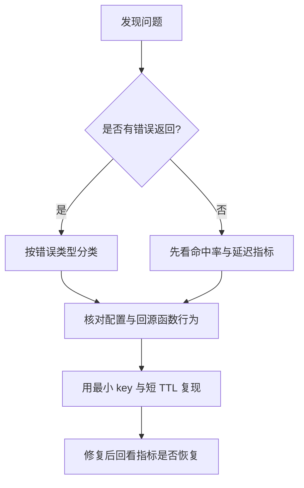

# 故障排查指南

本文档提供 `jetcache-go` 常见问题的快速排查路径。

## 排查流程



## 常见症状

| 症状 | 常见原因 | 快速检查 | 修复建议 |
| --- | --- | --- | --- |
| 长期未命中，命中率接近 0 | key 不一致 / TTL 过短 | 对比读写 key；检查 TTL 配置 | 统一 key 生成；适当增加 TTL |
| `cache: both remote and local are nil` | 未配置缓存后端 | 检查 `cache.New(...)` 配置 | 配置 `WithLocal(...)` 或 `WithRemote(...)` |
| 数据库压力突增 | 未走 singleflight 回源路径 | 检查是否 `Get + 手工回源` | 改为 `Once(...) + Do(...)` |
| 持续返回 `not found` | 命中了空值占位符缓存 | 检查 `WithErrNotFound(...)` 与 not-found TTL | 调整 `WithNotFoundExpiry(...)` |
| 多实例本地缓存不一致 | 本地失效事件未同步 | 检查 `WithSyncLocal` 与事件链路 | 增加消息总线同步或优先远程读取 |
| 刷新任务不断增长 | 对过多 key 开启了刷新 | 观察 `TaskSize()` | 收敛刷新 key，并设置停止刷新窗口 |
| 启动时 codec panic | codec 名称未注册 | 检查 `WithCodec(...)` | 注册 codec 或改用内置 codec |

## 典型错误说明

## `cache: key is missing`

含义：

- 当前读取路径出现缓存未命中。

建议：

- 核对是否应使用 `Once(...)` 而不是直接 `Get(...)`。
- 核对 key 拼接规则。
- 核对远程和本地 TTL 是否过短。

## `cache: both remote and local are nil`

含义：

- local 和 remote 都未配置。

建议：

- 至少配置一个后端（`WithLocal` 或 `WithRemote`）。

## not-found 持续返回

含义：

- 命中了防穿透占位符缓存。

建议：

- 确认缺失记录返回策略是否符合预期。
- 调整 `WithNotFoundExpiry(...)` 与 `WithOffset(...)`。

## 性能类排查

## 命中率下降

按顺序检查：

1. 发布后 key 规则是否变化，
2. TTL 是否被改短，
3. codec 是否切换，
4. Redis 是否超时或不稳定。

## p99 延迟升高

按顺序检查：

1. 远程缓存网络 RTT，
2. `Do(...)` 回源耗时，
3. 是否出现大量冷 key 绕过本地缓存，
4. 刷新并发是否挤占后端容量。

## Redis 侧快速检查

```bash
redis-cli INFO stats
redis-cli INFO commandstats
redis-cli --scan --pattern 'your-prefix:*' | head
```

重点关注 timeout、evictions、命令延迟和 key 基数。

## 安全复现方式

先用单 key + 极简回源函数：

```go
var out string
err := c.Once(ctx, "debug:key:1",
	cache.Value(&out),
	cache.Do(func(context.Context) (any, error) {
		return "ok", nil
	}),
)
```

再逐步增加复杂度：

1. 真实 key 规则，
2. 真实 payload，
3. 真实 DB 回源函数，
4. 自动刷新选项。

## 提交 Issue 建议信息

- 缓存拓扑（`local`/`remote`/`both`），
- key 示例，
- TTL 与 not-found 配置，
- 命中率/失败率指标片段，
- 最小可复现代码。
