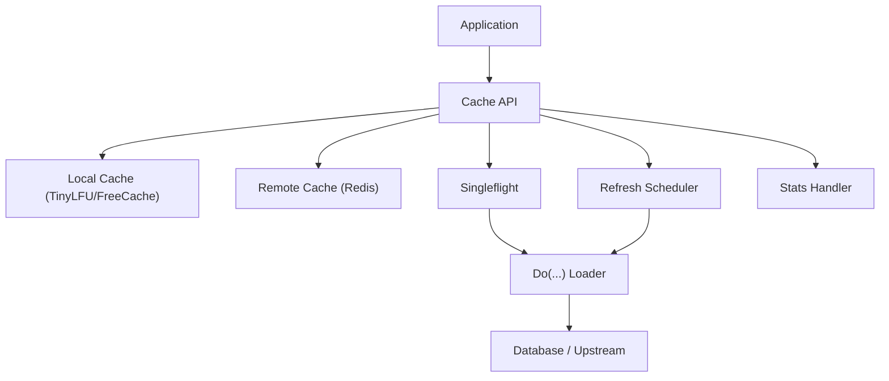
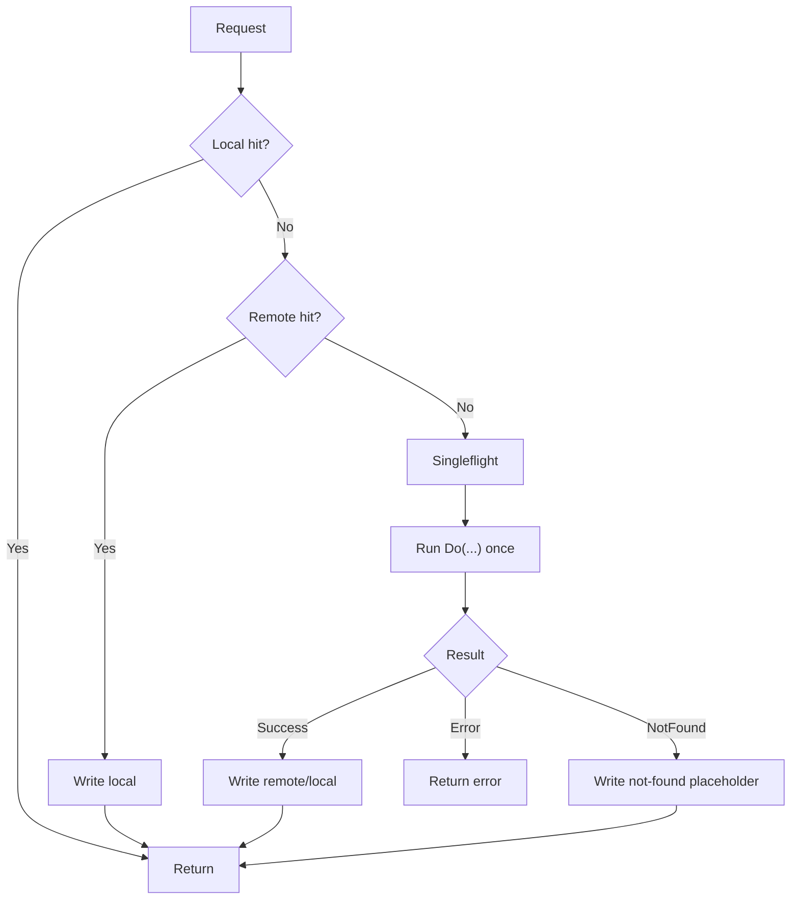
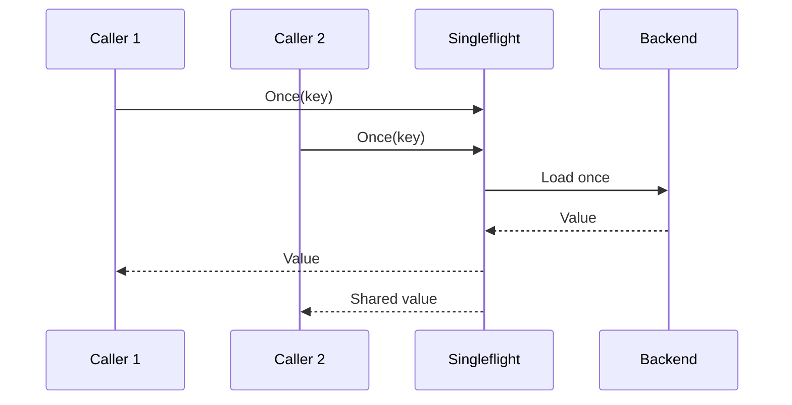
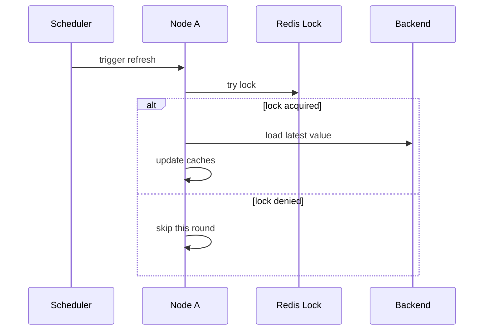

# System Architecture

`jetcache-go` is a layered cache framework for cache-aside reads and high-concurrency protection.

## Layered View

## Cache Modes

- `local`: in-process only, lowest latency, no cross-node sharing.
- `remote`: shared cache only, stronger cross-node consistency.
- `both`: local + remote, recommended for high-QPS read APIs.

## Read Path (`Once`)

Key point: use `Once(...) + Do(...)` on read paths so concurrent misses collapse to one backend call.

## Singleflight Behavior

## Auto-Refresh Behavior

Refresh is key-level and opt-in (`cache.Refresh(true)`).

Use refresh only for a small set of hot keys with expensive loaders.

## Component Responsibilities

| Component | Responsibility | Built-in Choice |
| --- | --- | --- |
| `local.Local` | In-process cache | `TinyLFU`, `FreeCache` |
| `remote.Remote` | Shared cache backend | `go-redis/v9` adapter |
| `encoding.Codec` | Serialization | `msgpack`, `json`, `sonic` |
| `stats.Handler` | Metrics emission | logger, Prometheus plugin |
| `singleflight` | Miss coalescing | `x/sync/singleflight` |
| refresh scheduler | Periodic update | built-in |

## Design Notes

- Keep key format deterministic across writers/readers.
- Keep `WithErrNotFound(...)` aligned with real datastore not-found errors.
- Enable `WithStopRefreshAfterLastAccess(...)` when refresh is on.
- Call `Close()` on graceful shutdown to stop background tasks.
