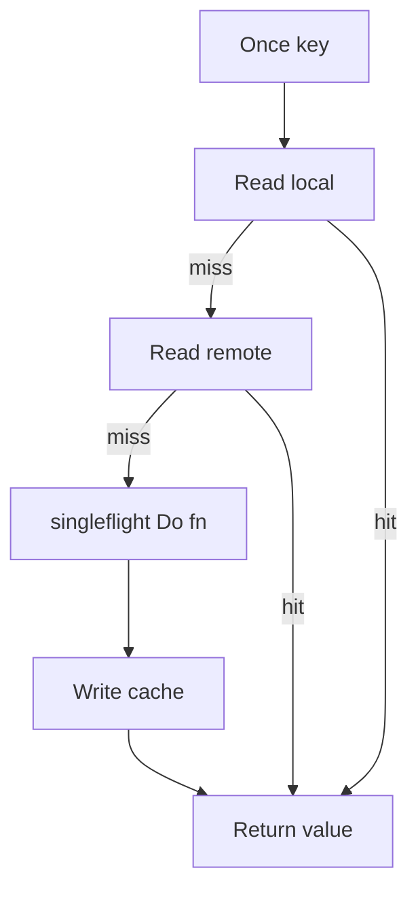
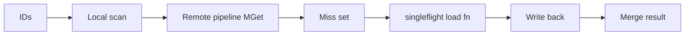

# Cache API Reference

This page is the compact API reference for `jetcache-go`.

## Cache Interface

`cache.New(...)` returns a `Cache` with these methods:

| Method | Purpose |
| --- | --- |
| `Set(ctx, key, opts...)` | Write cache value. |
| `Once(ctx, key, opts...)` | Cache-aside read with singleflight. |
| `Get(ctx, key, val)` | Read and unmarshal value. |
| `GetSkippingLocal(ctx, key, val)` | Read from remote path only. |
| `Delete(ctx, key)` | Delete local + remote cache. |
| `DeleteFromLocalCache(key)` | Delete local cache only. |
| `Exists(ctx, key)` | Check key existence by read path. |
| `TaskSize()` | Auto-refresh task count in current process. |
| `CacheType()` | `local`, `remote`, or `both`. |
| `Close()` | Stop refresh/event loops and release resources. Call once per cache instance lifecycle. |

## ItemOption

| Option | Type | Notes |
| --- | --- | --- |
| `Value(v)` | `any` | Set value for `Set`; output target for `Once`. |
| `Do(fn)` | `func(context.Context) (any, error)` | Load callback on miss. Has higher priority than `Value`. |
| `TTL(d)` | `time.Duration` | Remote TTL. `0` uses default. `<0` means do not write remote. |
| `SetNX(true)` | `bool` | Remote only. Set if key does not exist. |
| `SetXX(true)` | `bool` | Remote only. Set if key exists. |
| `SkipLocal(true)` | `bool` | Skip local cache on read path. |
| `Refresh(true)` | `bool` | Enable refresh task for this key (`WithRefreshDuration` required, and should be paired with `Do(...)`). |

## Core Example

```go
package main

import (
	"context"
	"time"

	cache "github.com/mgtv-tech/jetcache-go"
	"github.com/mgtv-tech/jetcache-go/local"
	"github.com/mgtv-tech/jetcache-go/remote"
	"github.com/redis/go-redis/v9"
)

func main() {
	rdb := redis.NewClient(&redis.Options{Addr: "127.0.0.1:6379"})
	c := cache.New(
		cache.WithName("api-demo"),
		cache.WithLocal(local.NewTinyLFU(100_000, time.Minute)),
		cache.WithRemote(remote.NewGoRedisV9Adapter(rdb)),
	)
	defer c.Close()

	// Set
	_ = c.Set(context.Background(), "user:1001", cache.Value("alice"), cache.TTL(30*time.Minute))

	// Once
	var user string
	_ = c.Once(context.Background(), "user:1002",
		cache.Value(&user),
		cache.Do(func(context.Context) (any, error) {
			return "bob", nil
		}),
	)

	// Delete
	_ = c.Delete(context.Background(), "user:1001")
}
```

## `Once` Execution Model



## Generic API

Use `NewT[K, V]` with a `cache.Cache` instance for typed access:

| Method | Purpose |
| --- | --- |
| `Set(ctx, key, id, v)` | Typed set. |
| `Get(ctx, key, id, fn)` | Typed once-get with loader. |
| `Delete(ctx, key, id)` | Typed delete. |
| `Exists(ctx, key, id)` | Typed existence check. |
| `MGet(ctx, key, ids, fn)` | Typed batch read (best-effort). |
| `MGetWithErr(ctx, key, ids, fn)` | Typed batch read with explicit errors. |

`MGet` load callback (`fn`) and remote pipeline optimization are available since `v1.1.0+`.

Typed `MGet` flow:



## `MGet` Semantics

- `MGet(...)` is best-effort by default and prioritizes returning available data.
- Missed IDs are loaded through `fn` (when provided), then written back to cache.
- For IDs absent in `fn` results, jetcache writes short-lived not-found placeholders to avoid repeated penetration.
- Use `MGetWithErr(...)` when upstream must inspect partial failures explicitly.

## Error Semantics

- `Once(...)` hides raw cache miss and runs `Do(...)`.
- If `WithErrNotFound(err)` is set and `Do(...)` returns that error, jetcache writes placeholder and returns the same error on subsequent reads.
- `MGet(...)` is best-effort by default and may cache placeholders for missing IDs. Use `MGetWithErr(...)` when upstream needs full error visibility.
