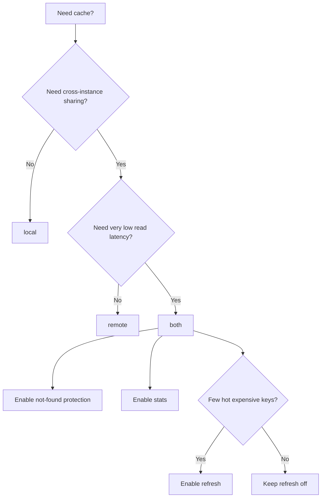

# Configuration Reference

This page defines all `cache.WithXxx(...)` options and minimal configuration patterns.

## Option Matrix

| Option | Type | Default | Notes |
| --- | --- | --- | --- |
| `WithName(name)` | `string` | `"default"` | Cache name for logs and metrics labels. |
| `WithRemote(remote)` | `remote.Remote` | `nil` | Remote cache backend. |
| `WithLocal(local)` | `local.Local` | `nil` | Local in-process backend. |
| `WithCodec(codec)` | `string` | `"msgpack"` | Must be registered. Unknown codec panics on `cache.New(...)`. |
| `WithErrNotFound(err)` | `error` | `nil` | Not-found sentinel for penetration protection. |
| `WithRemoteExpiry(d)` | `time.Duration` | `1h` | Default remote TTL. |
| `WithNotFoundExpiry(d)` | `time.Duration` | `1m` | TTL for not-found placeholder. |
| `WithOffset(d)` | `time.Duration` | `notFoundExpiry/10` (max `10s`) | TTL jitter for not-found placeholder. |
| `WithRefreshDuration(d)` | `time.Duration` | `0` | Refresh interval. `0` disables refresh. `(0,1s)` normalized to `1s`. |
| `WithStopRefreshAfterLastAccess(d)` | `time.Duration` | `refreshDuration + 1s` | Stop refresh for idle keys. |
| `WithRefreshConcurrency(n)` | `int` | `4` | Max parallel refresh workers. |
| `WithStatsDisabled(b)` | `bool` | `false` | Disable default stats chain. If you pass a custom `WithStatsHandler(...)`, that handler logic decides behavior. |
| `WithStatsHandler(h)` | `stats.Handler` | `stats.NewHandles(...)` | Custom stats handler chain. |
| `WithSourceId(id)` | `string` | random 16 chars | Event producer identity for local-sync invalidation; used to ignore self-origin events. |
| `WithSyncLocal(b)` | `bool` | `false` | Emit local invalidation events (effective in `both` mode). |
| `WithEventChBufSize(n)` | `int` | `100` | Event channel buffer size. |
| `WithEventHandler(fn)` | `func(event *cache.Event)` | `nil` | Event consumer callback. |
| `WithSeparatorDisabled(b)` | `bool` | `false` | Disable generic key separator. |
| `WithSeparator(sep)` | `string` | `":"` | Generic key separator. |

## Feature Availability by Version

- Generic `MGet` load callback + pipeline optimization: `v1.1.0+`
- Cross-process local cache invalidation events (`WithSyncLocal`): `v1.1.1+`

## Topology Templates

```go
package main

import (
	"time"

	cache "github.com/mgtv-tech/jetcache-go"
	"github.com/mgtv-tech/jetcache-go/local"
	"github.com/mgtv-tech/jetcache-go/remote"
	"github.com/redis/go-redis/v9"
)

func newLocal() cache.Cache {
	return cache.New(
		cache.WithName("local-cache"),
		cache.WithLocal(local.NewTinyLFU(100_000, time.Minute)),
	)
}

func newRemote(rdb *redis.Client) cache.Cache {
	return cache.New(
		cache.WithName("remote-cache"),
		cache.WithRemote(remote.NewGoRedisV9Adapter(rdb)),
		cache.WithRemoteExpiry(30*time.Minute),
	)
}

func newBoth(rdb *redis.Client) cache.Cache {
	return cache.New(
		cache.WithName("both-cache"),
		cache.WithLocal(local.NewTinyLFU(100_000, time.Minute)),
		cache.WithRemote(remote.NewGoRedisV9Adapter(rdb)),
		cache.WithRemoteExpiry(30*time.Minute),
	)
}

func main() {
	rdb := redis.NewClient(&redis.Options{Addr: "127.0.0.1:6379"})
	c := newBoth(rdb)
	defer c.Close()
}
```

## Scenario Add-ons

## Penetration protection

```go
cache.WithErrNotFound(sql.ErrNoRows)
cache.WithNotFoundExpiry(45 * time.Second)
```

## Auto-refresh for hot keys

```go
cache.WithRefreshDuration(time.Minute)
cache.WithStopRefreshAfterLastAccess(15 * time.Minute)
cache.WithRefreshConcurrency(8)
```

At call site, enable per key:

```go
cache.Refresh(true)
```

Recommendation: use `Refresh(true)` together with `Do(...)`, so refresh tasks can load fresh values from upstream.

## Multi-handler stats (Log + Prometheus)

```go
cache.WithStatsHandler(stats.NewHandles(false,
	stats.NewStatsLogger(cacheName),
	pstats.NewPrometheus(cacheName),
))
```

If `WithStatsHandler(...)` is configured, `WithStatsDisabled(...)` does not override your custom handler implementation.

## Local sync events

```go
cache.WithSyncLocal(true)
cache.WithSourceId("service-a-node-1")
cache.WithEventHandler(func(event *cache.Event) {
	// publish/consume invalidation event
})
```

## SourceID purpose and generation

`SourceID` is attached to every invalidation event (`cache.Event.SourceID`) when `WithSyncLocal(true)` is enabled.

Use it to:

- identify which instance produced an event,
- ignore your own events on consume side (`event.SourceID == mySourceID`),
- avoid local invalidation loops and simplify diagnostics.

Generation guidance:

- Must be unique per running cache instance.
- Stable during one process lifetime.
- Human-readable for debugging.

Recommended format:

```text
<service>-<env>-<instanceID>-<bootNonce>
```

Where:

- `instanceID`: Pod UID, VM ID, or host identity.
- `bootNonce`: process-start random suffix to avoid collisions after rapid restarts.

Minimal fallback when no platform instance ID is available:

```go
package main

import (
	"crypto/rand"
	"fmt"
	"os"
)

func buildSourceID(service, env string) string {
	host, _ := os.Hostname()
	nonce := make([]byte, 4)
	_, _ = rand.Read(nonce)
	return fmt.Sprintf("%s-%s-%s-%d-%x", service, env, host, os.Getpid(), nonce)
}
```

## Decision Guide



## Validation Checklist

- Configure at least one backend (`local` or `remote`).
- Use explicit `WithName(...)` in production.
- Keep `WithErrNotFound(...)` consistent with datastore not-found errors.
- Call `Close()` exactly once on graceful shutdown when refresh is enabled.
- If `WithSyncLocal(true)` is enabled, provide `WithEventHandler(...)`.
