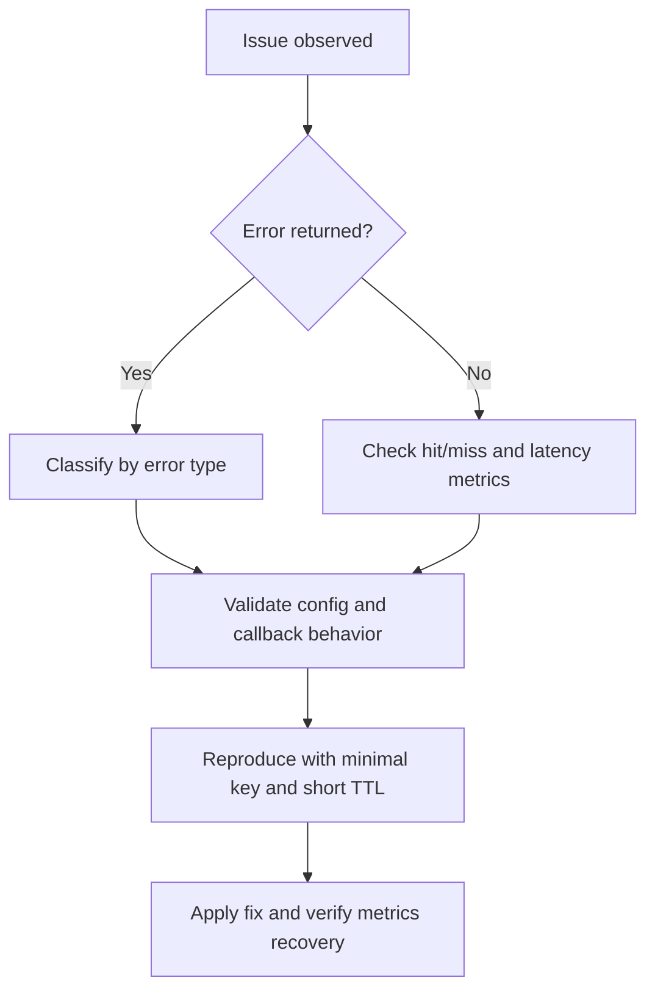

# Troubleshooting Guide

This guide provides fast diagnosis for common `jetcache-go` issues.

## Triage Workflow



## Common Symptoms

| Symptom | Likely Cause | Quick Check | Fix |
| --- | --- | --- | --- |
| Always miss, hit ratio near 0 | Key mismatch / TTL too short | Compare written/read key; check TTL setup | Normalize key builder; increase TTL |
| `cache: both remote and local are nil` | No backend configured | Check `cache.New(...)` options | Configure `WithLocal(...)` or `WithRemote(...)` |
| Frequent DB pressure spike | No singleflight path used | Search for `Get + manual query` pattern | Switch to `Once(...) + Do(...)` |
| `not found` keeps returning | Placeholder cache active | Check `WithErrNotFound(...)` and not-found TTL | Tune `WithNotFoundExpiry(...)` |
| Local cache stale across nodes | Local invalidation not synchronized | Check `WithSyncLocal` and event bridge | Add event bus handling or prefer remote read |
| Refresh tasks keep growing | Refresh enabled on too many keys | Observe `TaskSize()` | Limit refresh keys and configure stop window |
| Startup panic for codec | Codec name not registered | Check `WithCodec(...)` value | Register codec or use built-in codec |

## Error-Specific Notes

## `cache: key is missing`

Meaning:

- cache miss on current read path.

Actions:

- Verify whether call site should use `Once(...)` instead of raw `Get(...)`.
- Validate key format consistency.
- Verify remote TTL and local TTL are not too short.

## `cache: both remote and local are nil`

Meaning:

- neither local nor remote cache is configured.

Actions:

- Add at least one backend (`WithLocal` or `WithRemote`).

## Not-found sentinel returned repeatedly

Meaning:

- placeholder value is cached for not-found protection.

Actions:

- Confirm expected behavior for missing records.
- Tune `WithNotFoundExpiry(...)` and `WithOffset(...)`.

## Performance Diagnostics

## Hit ratio dropped

Check in order:

1. key changes after release,
2. TTL changes,
3. serialization changes,
4. backend (Redis) timeout or failures.

## High p99 latency

Check in order:

1. remote cache network RTT,
2. DB callback latency in `Do(...)`,
3. too many cold keys bypassing local cache,
4. refresh concurrency causing backend contention.

## Redis-side Quick Checks

```bash
redis-cli INFO stats
redis-cli INFO commandstats
redis-cli --scan --pattern 'your-prefix:*' | head
```

Focus on timeout, evictions, command latency, and key cardinality.

## Safe Reproduction Pattern

Use one representative key and tiny load function:

```go
var out string
err := c.Once(ctx, "debug:key:1",
	cache.Value(&out),
	cache.Do(func(context.Context) (any, error) {
		return "ok", nil
	}),
)
```

Then incrementally add:

1. real key builder,
2. real payload,
3. real DB callback,
4. refresh option.

## Escalation Checklist

When opening an issue, include:

- cache topology (`local`/`remote`/`both`),
- key format sample,
- TTL/not-found settings,
- stats snippet (hit/miss/query_fail),
- minimal reproducible code.
